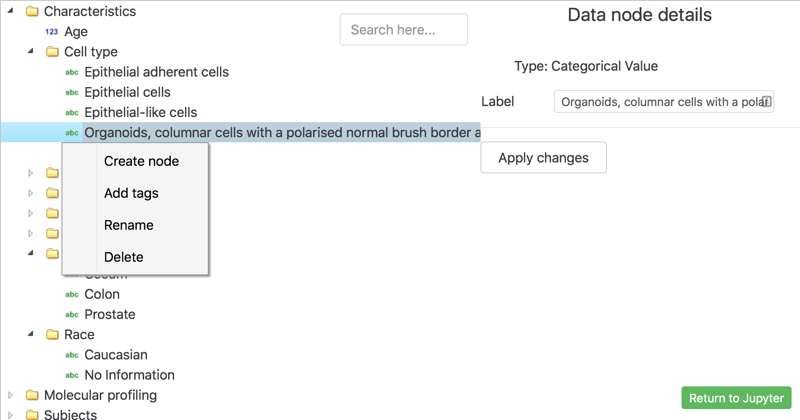

=============
User examples
=============

These examples have been extracted from Jupyter Notebooks.

Create study from clinical data.
--------------------------------

tmtk has a wizard that can be used to quickly go from clinical data
files to a study object. The main goal of this functionality is to
reduce the barrier of setting up all transmart-batch specific files
(i.e. parameter files, column mapping and word mapping files).

The way to use it is to call ``tmtk.wizard.create_study(path)``, where
path points a directory with clinical data files.

Note: clinical datafiles have to be in a format that is accepted by
transmart-batch.

Here we will create a study from these two files:

.. code:: python

    import os
    files_dir = './studies/wizard/'
    os.listdir(files_dir)

.. parsed-literal::

    ['Cell-line_clinical.txt', 'Cell-line_NHTMP.txt']

.. code:: python

    # Load the toolkit
    import tmtk

.. code:: python

    # Create a study object by running the wizard
    study = tmtk.wizard.create_study('./studies/wizard/')

.. parsed-literal::

    ==========  study params  ==========
    Updating:  TOP_NODE=\(Public|Private) Studies\<STUDY_ID> (default).
    Helptext:  The study top node.
    Change to:  \\Public Studies\\You're a wizard Harry
    Updating! (TOP_NODE=\Public Studies\You're a wizard Harry)
    --------------------
    Updating:  STUDY_ID=Uppercased parent directory.
    Helptext:  Identifier of the study.
    Change to:  WIZARD
    Updating! (STUDY_ID=WIZARD)
    --------------------
    Updating:  SECURITY_REQUIRED=N (default).
    Helptext:  Defines study as Private (Y) or Public (N).
    Change to:  N
    Updating! (SECURITY_REQUIRED=N)
    --------------------
    ==========  clinical params  ==========
    Updating:  TAGS_FILE (not set)
    Helptext:  Points to the concepts tags file.
    Change to:
    --------------------
    Updating:  WORD_MAP_FILE (not set)
    Helptext:  Points to the file with dictionary to be used.
    Change to:
    --------------------
    Updating:  COLUMN_MAP_FILE (not set)
    Helptext:  Points to the column file.
    Change to:
    --------------------
    Updating:  XTRIAL_FILE (not set)
    Helptext:  Points to the cross study concepts file.
    Change to:
    --------------------

    #####  Please select your clinical datafiles  #####
    -    0. /Users/jb/thehyve/tmtk/studies/wizard/Cell-line_clinical.txt
    -    1. /Users/jb/thehyve/tmtk/studies/wizard/Cell-line_NHTMP.txt
    Pick number:  0
    Selected files: ['Cell-line_clinical.txt']
    Pick number:  1
    Selected files: ['Cell-line_clinical.txt', 'Cell-line_NHTMP.txt']
    Pick number:

.. raw:: html

    
&#x2705; Adding 'Cell-line_clinical.txt' as clinical datafile to study.

    
&#x2705; Adding 'Cell-line_NHTMP.txt' as clinical datafile to study.

--------------

The wizard walked us through some of the options for the study we want
to create. Our new study is a public study with ``STUDY_ID==WIZARD`` and
an appropriate name. None of the clinical params have been set, so tmtk
will use default names for the column and word mapping file. Next the
datafiles have been loaded and the column mapping object has been
created to include the data files.

Next we will run the validator and find out that some files cannot be
found. This is expected as these objects are only in memory and not yet
on disk.

.. code:: python

    study.validate_all(5)

.. raw:: html

    
&#9888; No valid file found on disk for /Users/jb/thehyve/tmtk/studies/wizard/clinical/word_mapping_file.txt, creating dataframe.

    <h3>Validating params file at clinical</h3>
    
&#x274C; WORD_MAP_FILE=word_mapping_file.txt cannot be found.

    
&#x274C; COLUMN_MAP_FILE=column_mapping_file.txt cannot be found.

    
Detected parameter WORD_MAP_FILE=word_mapping_file.txt.

    
Detected parameter COLUMN_MAP_FILE=column_mapping_file.txt.

    <h3>Validating params file at study</h3>
    
Detected parameter TOP_NODE=\Public Studies\You're a wizard Harry\.

    
Detected parameter STUDY_ID=WIZARD.

    
Detected parameter SECURITY_REQUIRED=N.

--------------

Of course, we want to write our study to disk so it can be loaded with
transmart-batch.

.. code:: python

    study.write_to('~/studies/my_new_study')

.. raw:: html

    
Writing file to /Users/jb/studies/my_new_study/clinical/clinical.params

    
Writing file to /Users/jb/studies/my_new_study/study.params

    
Writing file to /Users/jb/studies/my_new_study/clinical/column_mapping_file.txt

    
Writing file to /Users/jb/studies/my_new_study/clinical/Cell-line_clinical.txt

    
Writing file to /Users/jb/studies/my_new_study/clinical/word_mapping_file.txt

    
Writing file to /Users/jb/studies/my_new_study/clinical/Cell-line_NHTMP.txt

====

TranSMART Arborist
------------------

GUI editor for the concept tree.
^^^^^^^^^^^^^^^^^^^^^^^^^^^^^^^^

First load the toolkit.

.. code:: python

    import tmtk

Create a study object by entering a "study.params" file.

.. code:: python

    study = tmtk.Study('../studies/valid_study/study.params')

To verify the study object is compatible with transmart-batch for
loading you can run the validator

.. code:: python

    study.validate_all()

.. raw:: html

    <h3>Validating Tags:</h3>

    
&#x274C; Tags (2) found that cannot map to tree: (1. Cell line characteristics∕1. Cell lines∕Age and 1. Cell line characteristics∕1. Cell lines∕Gender). You might want to call_boris() to fix them.

We will ignore this issue for now as this will be fixed automatically
when calling the Arborist GUI.

The GUI allows a user to interactively edit all aspects of TranSMART's
concept tree, this include:

-  Concept Paths from the clinical column mapping.
-  Word mapping from clinical data files.
-  High dimensional paths from subject sample mapping files.
-  Meta data tags

.. code:: python

    # In a Jupyter Notebook, this brings up the interactive concept tree editor.
    study.call_boris()

Once returned from The Arborist to Jupyter environment we can write the
updated files to disk. You can then run transmart-batch on that study to
load it into your tranSMART instance.

.. code:: python

    study.write_to('~/studies/updated_study')

Collaboration with non technical users.
^^^^^^^^^^^^^^^^^^^^^^^^^^^^^^^^^^^^^^^

Though using Jupyter Notebooks is great for technical users, less
technical domain experts might quickly feel discouraged. To allow for
collaboration with these users we will upload this concept tree to a
running Boris as a Service webserver. This will allow others to make
refinements to the concept tree.

.. code:: python

    study.publish_to_baas('arborist-test-trait.thehyve.net')

Once the study is updated in BaaS, we can update the local files by
copying the url for the latest tree into this command.

.. code:: python

    study.update_from_baas('arborist-test-trait.thehyve.net/trees/valid-study/3/~edit')

